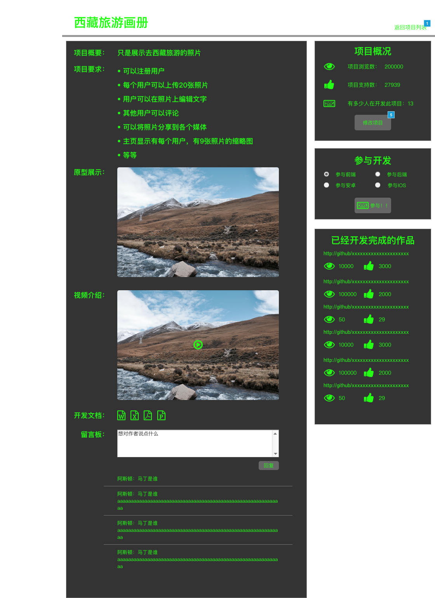

#所有页面的截图  
来自word文档

##列表相关页面

###index.png  
首页  

###publish.png 
我发布的项目列表页面

###developed.png 
我开发的页面

##详情相关页面
###add-project.png  
添加项目  

###modi-project.png  
修改项目

###details-publish.png  
我发布的项目-项目详情

##后台管理页面
###profess.png  
后台管理-专家审核  

###admin-projects.png 
后台管理-项目审核

###skill.png 
后台管理-技能审核

##注册相关页面
###reg-base.png  
注册页面基本信息

###reg-start.png 
注册/登陆 页面

###profile.png 
个人信息页面
  